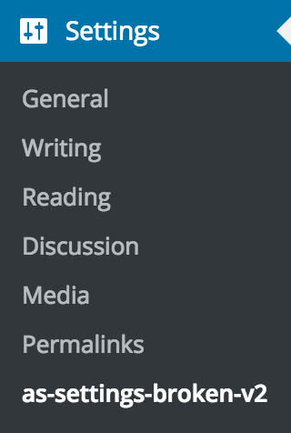
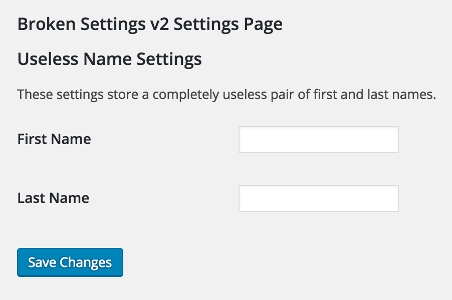

# Example Code: Settings Page - Broken Implementation v2

*__This example code is part of the article: [Using A Config To Write Reusable Code](https://www.alainschlesser.com/config-files-for-reusable-code/)__*

This is an improved "OOP" implementation of a settings page using the WordPress Settings API. It uses separate views to extract (some of) the business logic out of the core `SettingsPage` class.

To test this plugin yourself, clone the repository into a `wp-content/plugins` folder of a WordPress installation, and run the command `composer install` from within the plugin's folder to generate the autoloader. You should then be able to activate the plugin and get access to the generated settings page via `Settings` &rarr; `as-settings-broken-v2`.

Clicking on this menu entry will bring you to the generated Settings page, which allows you to save two useless settings.

